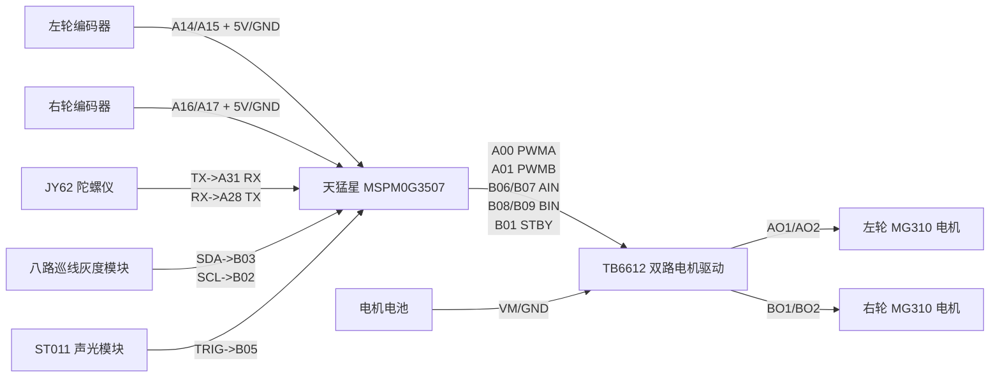

# 完整接线图

本接线图按天猛星 MSPM0G3507 开发板背面可读引脚图整理，目标是兼顾插线整齐和功能可用。

## 总览

## TB6612 双路电机驱动

| TB6612 | MSPM0G3507 | 说明 |
| --- | --- | --- |
| `PWMA` | `A00 / TIMA0-C0` | 左轮 PWM |
| `PWMB` | `A01 / TIMA0-C1` | 右轮 PWM |
| `AIN1` | `B06` | 左轮方向 1 |
| `AIN2` | `B07` | 左轮方向 2 |
| `BIN1` | `B08` | 右轮方向 1 |
| `BIN2` | `B09` | 右轮方向 2 |
| `STBY` | `B01` | 使能脚，初始化先拉低，准备好后拉高 |
| `VCC` | `3V3` | TB6612 逻辑电源 |
| `GND` | `GND` | 与主控、电池负极共地 |
| `VM` | 电机电池正极 | 电机供电，建议 12V，不建议超过 13.5V 长期工作 |
| `ADC` | `A12 / ADC`，可不接 | 电池电压检测，接了才能做电压监控 |

## 编码器

| 编码器 | MSPM0G3507 | 说明 |
| --- | --- | --- |
| 左 B轮 A 相 | `A14` | GPIOA 中断输入 |
| 左 B轮 B 相 | `A15` | GPIOA 中断输入 |
| 右 A轮 A 相 | `A16` | GPIOA 中断输入 |
| 右 A轮 B 相 | `A17` | GPIOA 中断输入 |
| 左/右编码器 `5V` | `5V` | 编码器供电 |
| 左/右编码器 `GND` | `GND` | 必须与主控共地 |

## JY62 陀螺仪

| JY62 | MSPM0G3507 | 说明 |
| --- | --- | --- |
| `TX` | `A31 / UART0-RX` | JY62 发数据，主控接收 |
| `RX` | `A28 / UART0-TX` | 主控给 JY62 发配置/校准命令 |
| `VCC` | `3V3` 或 `5V` | 按 JY62 模块规格 |
| `GND` | `GND` | 必须共地 |

串口是交叉连接：`JY62_TX -> MCU_RX`，`JY62_RX -> MCU_TX`。

## 八路巡线灰度模块

| 巡线模块 | MSPM0G3507 | 说明 |
| --- | --- | --- |
| `SDA` | `B03 / I2C-SDA` | I2C 数据线 |
| `SCL` | `B02 / I2C-SCL` | I2C 时钟线 |
| `VCC` | 优先 `3V3` | 若模块 I2C 上拉到 5V，需电平转换或改 3.3V 上拉 |
| `GND` | `GND` | 必须共地 |

八路巡线 I2C 地址为 `0x12`，读取寄存器 `0x30` 得到 8 路状态。

## ST011 声光模块

| ST011 | MSPM0G3507 | 说明 |
| --- | --- | --- |
| 触发脚 | `B05` | 普通 GPIO 输出 |
| `VCC` | `3V3` 或 `5V` | 按模块规格 |
| `GND` | `GND` | 必须共地 |

ST011 为低电平触发，软件里触发逻辑要取反。

## 按键和遥控开关

| 功能 | MSPM0G3507 |
| --- | --- |
| `Key1` | `B22` |
| `Key2` | `B21` |
| `Key3` | `B23` |
| `Key4` | `B10` |
| 遥控/启停开关 | `B13` |

## 电源共地

| 连接 | 要求 |
| --- | --- |
| 电机电池正极 | 接 TB6612 `VM` |
| 电机电池负极 | 接 TB6612 `GND`，并与 MSPM0 `GND` 共地 |
| TB6612 `VCC` | 接 MSPM0 `3V3` |
| 所有模块 `GND` | 全部接到同一地线系统 |

## 需要在软件中对应修改

- SysConfig 中 UART0 改为 `A28/A31`
- SysConfig 中 I2C 改为 `B02/B03`
- SysConfig 中 TB6612 GPIO 改为 `B01/B06/B07/B08/B09`
- 编码器输入改为 `A14/A15/A16/A17`
- ST011 输出保持 `B05`，但触发极性改为低有效
