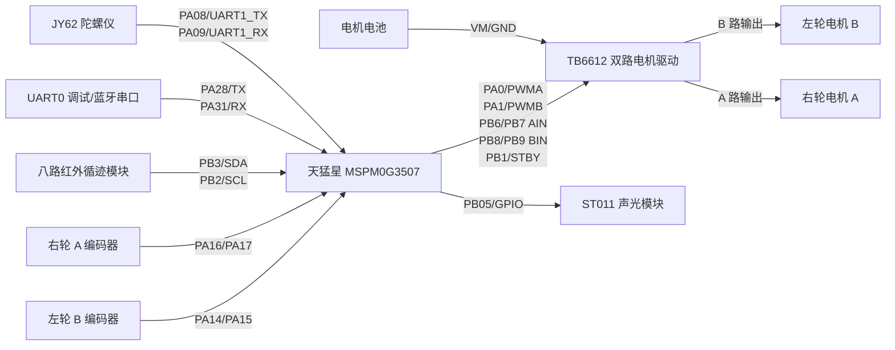

# 暂行接线图

本文件记录当前代码已经使用或计划使用的接线。它是调试阶段的暂行版本，后续如果更换引脚、增加蓝牙串口或接入 JY62，需要同步更新本文档和 `main.syscfg`。

当前已经实际使用或已经确定接线的模块：

- TB6612 电机驱动
- 左右轮编码器
- UART0 调试串口/蓝牙串口
- 八路红外循迹模块 I2C
- JY62 陀螺仪 UART1 串口
- ST011 声光模块触发脚

暂未完成当前程序逻辑的模块：

- 任务三/任务四路线逻辑

## 1. 总览

## 2. TB6612 双路电机驱动

当前代码约定：

- A 电机是右轮。
- B 电机是左轮。
- `TB6612_SetDifferential(left, right)` 的第一个参数控制左轮 B，第二个参数控制右轮 A。

| TB6612 信号 | MSPM0G3507 | 代码宏或外设 | 说明 |
|---|---|---|---|
| `PWMA` | `PA0 / A00` | `TIMA0_CCP0` | A 电机 PWM，右轮 |
| `PWMB` | `PA1 / A01` | `TIMA0_CCP1` | B 电机 PWM，左轮 |
| `AIN1` | `PB6 / B06` | `TB6612_AIN1_PIN` | A 电机方向 1 |
| `AIN2` | `PB7 / B07` | `TB6612_AIN2_PIN` | A 电机方向 2 |
| `BIN1` | `PB8 / B08` | `TB6612_BIN1_PIN` | B 电机方向 1 |
| `BIN2` | `PB9 / B09` | `TB6612_BIN2_PIN` | B 电机方向 2 |
| `STBY` | `PB1 / B01` | `TB6612_STBY_PIN` | 使能脚，高电平有效 |
| `VCC` | `3V3` | - | TB6612 逻辑电源 |
| `GND` | `GND` | - | 与主控和电机电池负极共地 |
| `VM` | 电机电池正极 | - | 电机供电 |

注意：

- `VM` 给电机供电，不能只靠 USB 或 DAPLink 供电。
- TB6612 的 `GND`、主控 `GND`、电机电池负极必须共地。
- 如果 `TB6612_SetDifferential(250, 250)` 时某个轮子反转，优先检查电机线，也可以修改 `BSP/inc/bsp_tb6612.h` 中的方向宏。

## 3. 编码器

当前使用 GPIOA 中断读取左右轮编码器 A/B 相。

| 编码器信号 | MSPM0G3507 | 代码宏 | 说明 |
|---|---|---|---|
| B 电机编码器 A 相 | `PA14 / A14` | `ENCODER_MOTOR_B_A_PIN` | 左轮编码器 A 相 |
| B 电机编码器 B 相 | `PA15 / A15` | `ENCODER_MOTOR_B_B_PIN` | 左轮编码器 B 相 |
| A 电机编码器 A 相 | `PA16 / A16` | `ENCODER_MOTOR_A_A_PIN` | 右轮编码器 A 相 |
| A 电机编码器 B 相 | `PA17 / A17` | `ENCODER_MOTOR_A_B_PIN` | 右轮编码器 B 相 |
| 编码器 `VCC` | 按编码器规格接 `3V3` 或 `5V` | - | 以商家模块规格为准 |
| 编码器 `GND` | `GND` | - | 必须共地 |

当前程序中：

- `ENCODER_MOTOR_B_FORWARD_SIGN` 为 `1`。
- `ENCODER_MOTOR_A_FORWARD_SIGN` 为 `-1`。

这两个宏用于保证小车前进时编码器速度为正。如果以后更换编码器线序或电机方向，需要重新观察串口中的 `A_cnt/B_cnt`。

## 4. 八路红外循迹模块

当前使用 I2C 方式读取八路数字量。

| 模块信号 | MSPM0G3507 | SysConfig 名称 | 说明 |
|---|---|---|---|
| `SDA` | `PB3 / B03` | `I2C_0_SDA` | I2C 数据线 |
| `SCL` | `PB2 / B02` | `I2C_0_SCL` | I2C 时钟线 |
| `VCC` | 优先 `3V3` | - | 避免 I2C 上拉到 5V |
| `GND` | `GND` | - | 必须共地 |

协议：

| 项目 | 值 |
|---|---|
| I2C 地址 | `0x12` |
| 数字量寄存器 | `0x30` |
| 原始数据方向 | `bit7=X1`，`bit0=X8` |
| 当前实测逻辑 | 黑线为 0，白底为 1 |

更多说明见 [docs/八路红外循迹模块驱动说明.md](docs/八路红外循迹模块驱动说明.md)。

## 5. UART0 调试串口和蓝牙串口

当前 UART0 用于 `lc_printf()` 调试输出，也可以接蓝牙串口模块做无线调试。

| 信号 | MSPM0G3507 | 说明 |
|---|---|---|
| `UART0_TX` | `PA28 / A28` | MCU 发送，接串口模块 RX |
| `UART0_RX` | `PA31 / A31` | MCU 接收，接串口模块 TX |
| `GND` | `GND` | 必须共地 |
| 波特率 | `115200` | 8 数据位，无校验，1 停止位 |

注意：

- MCU 的 TX 接模块 RX，MCU 的 RX 接模块 TX。
- 如果 DAPLink 串口和蓝牙串口同时接在 UART0 上，要避免两个外部 TX 同时驱动 `PA31/RX`。
- 当前程序主要是发送调试信息，还没有实现串口命令解析。

## 6. JY62 陀螺仪 UART1 串口

当前 PA08 和 PA09 已分配给 JY62 的 UART 串口。根据引脚复用图，PA08 可作为 `UART1_TX`，PA09 可作为 `UART1_RX`。当前程序已经加入 `BSP/inc/bsp_jy62.h`，并在 `main.c` 中提供 `ENABLE_JY62_UART_TEST` 测试模式。

| JY62 信号 | MSPM0G3507 | 外设功能 | 说明 |
|---|---|---|---|
| `RXD` | `PA08 / A08` | `UART1_TX` | MCU 发送，接 JY62 接收脚 |
| `TXD` | `PA09 / A09` | `UART1_RX` | MCU 接收，接 JY62 发送脚 |
| `VCC` | 按模块规格接 `3V3` 或 `5V` | - | 以 JY62 实物供电要求为准 |
| `GND` | `GND` | - | 必须与主控共地 |

重要提醒：

- MCU 的 TX 接模块 RX，MCU 的 RX 接模块 TX。
- `PA08/PA09` 独立于 UART0 调试/蓝牙串口，不要和 `PA28/PA31` 混接。
- 当前 `main.syscfg` 已启用 `UART1`，测试波特率暂定为 `115200`，格式为 8 数据位、无校验、1 停止位。
- 如果串口一直显示没有有效帧，优先检查供电、共地、TX/RX 交叉，以及 JY62 是否使用了 `9600` 等其他波特率。

## 7. ST011 声光模块

当前 `PB05 / B05` 分配给声光模块触发脚：

| 模块信号 | MSPM0G3507 | 说明 |
|---|---|---|
| 触发脚 | `PB5 / B05` | 普通 GPIO 输出，用于触发声光提示 |
| `VCC` | 按模块规格接 `3V3` 或 `5V` | 以实物为准 |
| `GND` | `GND` | 必须共地 |

ST011 如果是低电平触发，软件里需要把触发逻辑取反。当前程序已经在任务到点和任务结束时短暂触发声光提示。

## 8. 按键和遥控开关预留

当前 `main.syscfg` 中配置了四个任务按键输入：

| 功能 | MSPM0G3507 |
|---|---|
| `Key1 / 任务一` | `PA26 / A26` |
| `Key2 / 任务二` | `PA24 / A24` |
| `Key3 / 任务三` | `PB24 / B24` |
| `Key4 / 任务四` | `PA22 / A22` |

四个按键均按低电平按下处理，SysConfig 中已开启内部上拉。任务三和任务四目前只有入口和占位提示，路线逻辑后续再补。

## 9. 电源共地

电机类问题很多不是代码导致的，而是供电和共地导致的。当前建议：

| 连接 | 要求 |
|---|---|
| 电机电池正极 | 接 TB6612 `VM` |
| 电机电池负极 | 接 TB6612 `GND`，并与 MSPM0 `GND` 共地 |
| TB6612 `VCC` | 接 MSPM0 `3V3` |
| 红外模块 `GND` | 接 MSPM0 `GND` |
| 串口或蓝牙模块 `GND` | 接 MSPM0 `GND` |

如果小车只有接 DAPLink 或电脑时才运行，优先排查：

- 主控板是否有独立供电。
- TB6612 的 `VM` 是否有电。
- 电机电池负极和主控地是否共地。
- TB6612 `STBY` 是否被程序拉高。

## 10. 修改接线后的软件同步

如果以后换引脚，需要同时检查：

1. `main.syscfg` 中对应外设和 GPIO 的引脚分配。
2. `Debug/ti_msp_dl_config.h` 中生成的宏是否符合预期。
3. `BSP/inc` 中是否有写死方向或通道约定。
4. README 和本文档是否同步更新。

不要手动修改 `Debug/ti_msp_dl_config.c` 或 `Debug/ti_msp_dl_config.h`，它们会在 CCS 构建时重新生成。
